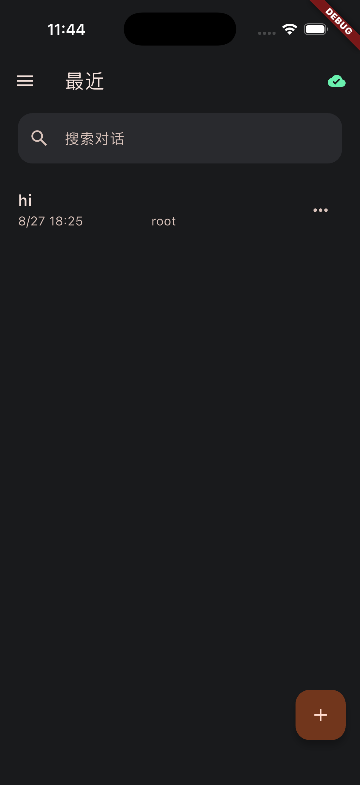
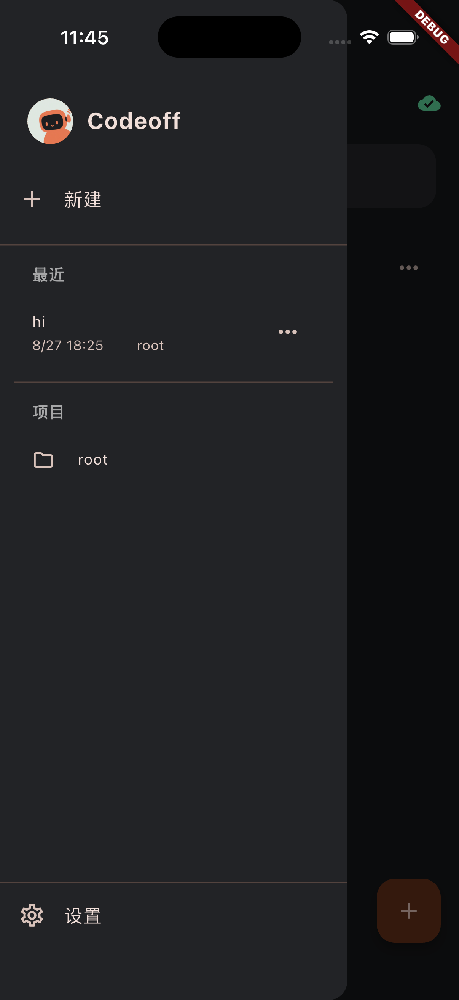
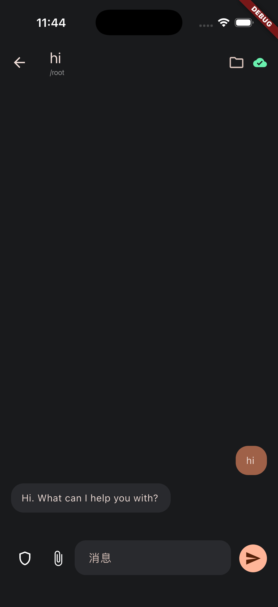
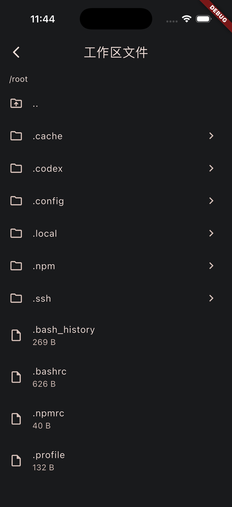
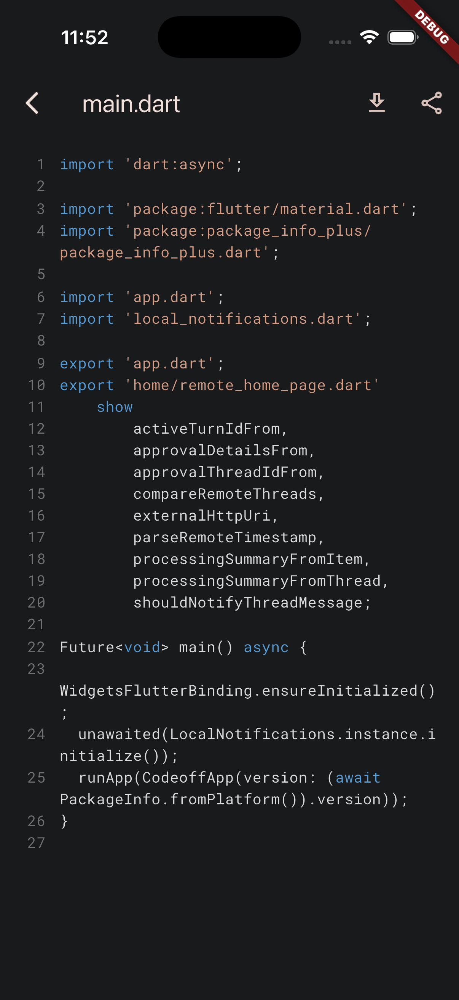
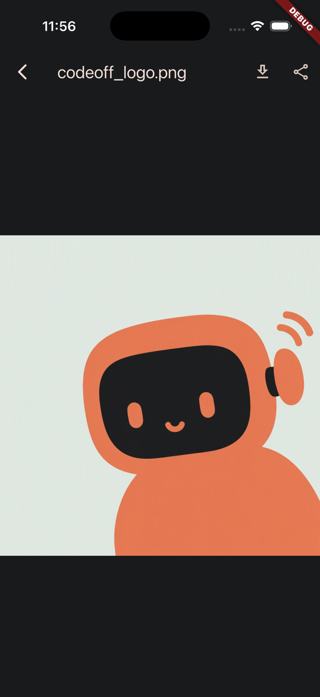
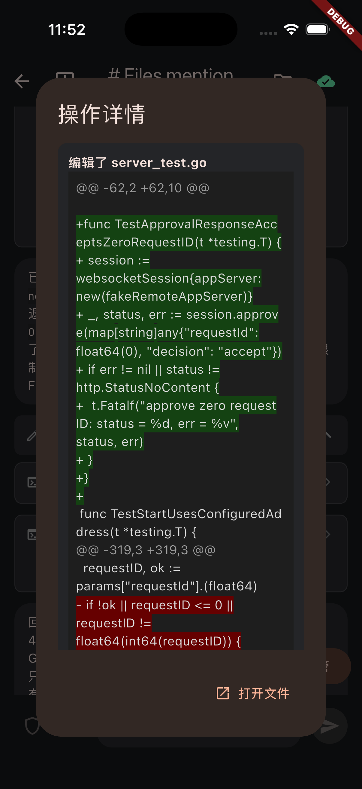
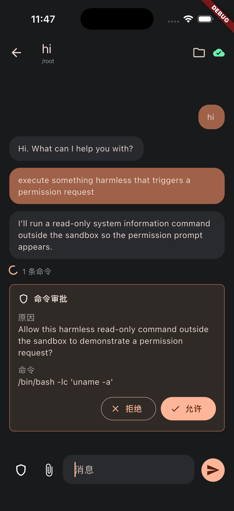

<p align="center">
  
</p>

<h1 align="center">Codeoff Mobile</h1>

<p align="center">
  <a href="https://github.com/MaimoryLab/codeoff/actions/workflows/ci-test.yml"></a>
  <a href="https://github.com/MaimoryLab/codeoff/actions/workflows/build-android.yml"></a>
  <a href="https://github.com/MaimoryLab/codeoff/releases/latest"></a>
  <a href="https://github.com/MaimoryLab/codeoff"></a>
</p>
<p align="center">
  <a href="README.zh-CN.md">中文</a>
</p>


Codeoff Mobile is a Flutter client for the local Codeoff desktop bridge. Pair it with Codeoff Server to control Codex from a phone: browse threads, start or resume work, send turns, upload files, and respond to approval requests.

The client talks to the bridge with Dart's standard `HttpClient` and a WebSocket session. No third-party networking or state-management package is required.

## Screenshots

<table align="center">
    <tr>
      <td></td>
      <td></td>
      <td></td>
      <td></td>
    </tr>
    <tr>
      <td></td>
      <td></td>
      <td></td>
      <td></td>
    </tr>
</table>

## How it works

1. Codeoff Server starts the local Codex app-server and publishes its control API through a Cloudflare Tunnel.
2. The mobile app exchanges the one-time pairing code for a device token.
3. The app opens an authenticated WebSocket session at `/api/v1/ws`; request IDs match responses and server events stream back on the same connection.
4. The device token is stored in secure storage so the app can reconnect without pairing again.

## Quickstart

### Use

#### 1. Install and configure Codeoff Server

Install and launch [Codeoff Server](https://github.com/MaimoryLab/codeoff-server) first:

1. Install Node.js and the Codex CLI.
2. Install `cloudflared` when the phone will connect from outside the local network; it is optional for local-network use.
3. Start the Codex app-server in Codeoff Server. Start the Cloudflare Tunnel for remote access, or configure a custom domain when a stable URL is needed.
4. Enable **Prevent system sleep** from the Codeoff Server menu bar item when long-running work must continue unattended.

#### 2. Install Codeoff Mobile

##### Android

Download the latest `app-release.apk` from the [Releases](https://github.com/MaimoryLab/codeoff/releases/latest) page and install it on an Android device.

##### iOS

Install the current build through [TestFlight](https://testflight.apple.com/join/zyAzftVb).

#### 3. Pair and connect

The recommended method is QR pairing:

1. In Codeoff Server, click **Bind new device**.
2. In Codeoff Mobile, tap the QR scanner and scan the pairing QR code.
3. The app reads the server address and one-time pairing code, pairs the device, and connects automatically.

For manual pairing:

1. Copy a listening address or Tunnel address and the pairing code from Codeoff Server.
2. In Codeoff Mobile, enter the address and tap **Connect**.
3. Enter the pairing code and device name when prompted.

After pairing, the device token is stored in secure storage for later reconnects.

### Develop

#### Requirements

- Flutter stable with Dart SDK `3.13` or newer
- An Android or iOS device/emulator
- A running Codeoff Server for end-to-end pairing

#### Run and check

```sh
flutter pub get
flutter run
dart analyze
flutter test --no-pub
```

Build an Android release locally with `flutter build apk --release`. The `Build Android APK` workflow publishes the APK to GitHub Releases for version tags (`v*.*.*`).

## Related project

- [Codeoff Server](https://github.com/MaimoryLab/codeoff-server): desktop bridge, local API, Codex app-server, and Cloudflare Tunnel.

## License

[Apache License 2.0](LICENSE)
