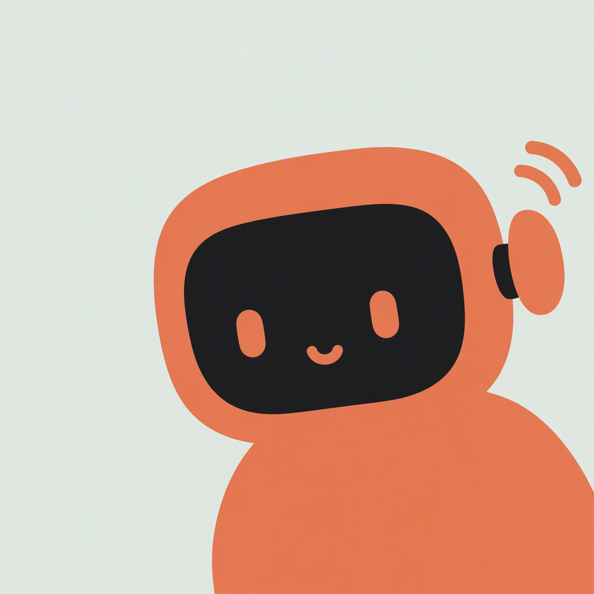

<p align="center">
  
</p>

<h1 align="center">Codeoff Mobile</h1>

<p align="center">
  <a href="https://github.com/MaimoryLab/codeoff/actions/workflows/ci-test.yml"></a>
  <a href="https://github.com/MaimoryLab/codeoff/actions/workflows/build-android.yml"></a>
  <a href="https://github.com/MaimoryLab/codeoff/releases/latest"></a>
  <a href="https://github.com/MaimoryLab/codeoff"></a>
  <a href="README.zh-CN.md">中文</a>
</p>

Codeoff Mobile is a Flutter client for the local Codeoff desktop bridge. Pair it with Codeoff Server to control Codex from a phone: browse threads, start or resume work, send turns, upload files, and respond to approval requests.

The client talks to the bridge with Dart's standard `HttpClient` and a WebSocket session. No third-party networking or state-management package is required.

## How it works

1. Codeoff Server starts the local Codex app-server and publishes its control API through a Cloudflare Tunnel.
2. The mobile app exchanges the one-time pairing code for a device token.
3. The app opens an authenticated WebSocket session at `/api/v1/ws`; request IDs match responses and server events stream back on the same connection.
4. The device token is stored in secure storage so the app can reconnect without pairing again.

## Quickstart

### Use

#### Android

Download the latest `app-release.apk` from the [Releases](https://github.com/MaimoryLab/codeoff/releases/latest) page and install it on an Android device.

#### iOS

Install the current build through [TestFlight](https://testflight.apple.com/join/zyAzftVb).

#### Pair a device

1. Start Codeoff Server and enable its Cloudflare Tunnel.
2. Copy the tunnel endpoint and one-time pairing code from the desktop panel.
3. Enter both values in Codeoff Mobile and tap **Pair**.
4. Keep the returned device token for later reconnects. The app stores it in secure device storage.

### Develop

#### Requirements

- Flutter stable with Dart SDK `3.13` or newer
- An Android or iOS device/emulator
- A running Codeoff Server for end-to-end pairing

#### Run and check

```sh
flutter pub get
flutter run
dart analyze
flutter test --no-pub
```

Build an Android release locally with `flutter build apk --release`. The `Build Android APK` workflow publishes the APK to GitHub Releases for version tags (`v*.*.*`).

## Related project

- [Codeoff Server](https://github.com/MaimoryLab/codeoff-server): desktop bridge, local API, Codex app-server, and Cloudflare Tunnel.

## License

[Apache License 2.0](LICENSE)
